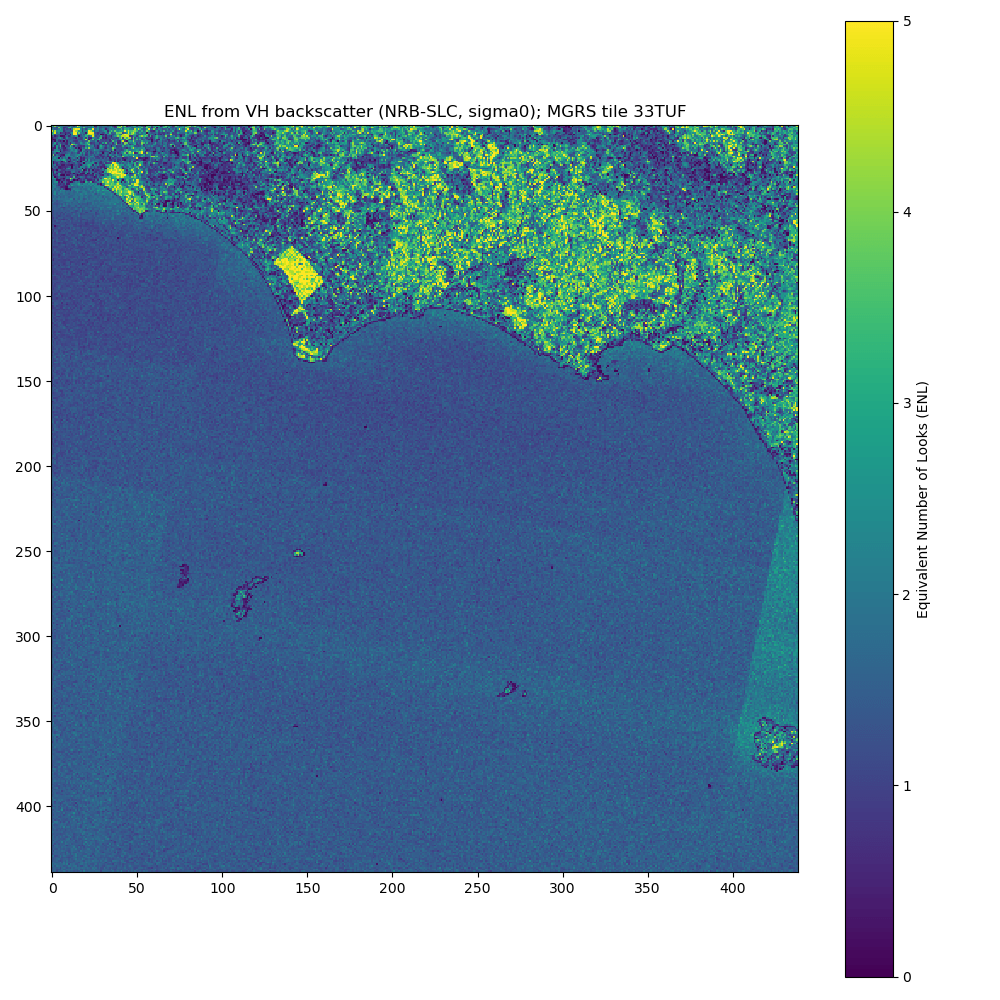
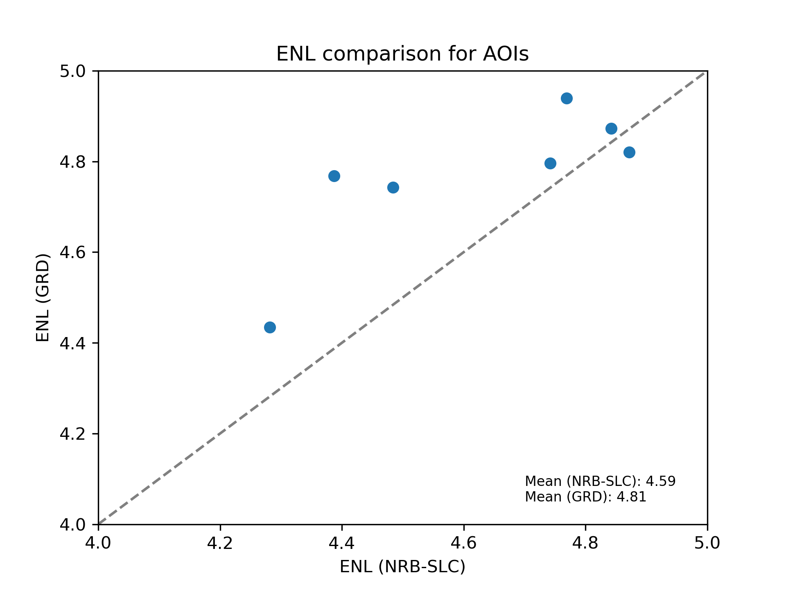

Equivalent Number of Looks (ENL)
================================

The Equivalent Number of Looks (ENL) describes the degree of averaging applied to SAR measurements during data formation
and postprocessing and is an indirect measure of speckle reduction (e.g., due to multilooking or speckle filtering).

In case of linear scaled backscatter data, ENL can be calculated as:

.. math::
    ENL = \frac{\mu^2}{\sigma^2}

where :math:`\mu` is the mean and :math:`\sigma` is the standard deviation of the image. ([1], section A1.1.7)

The ENL value stored in the metadata of each S1-NRB product is calculated as suggested in [2], where ENL is first
calculated for small pixel windows over the cross-polarized backscatter image and afterwards the median value of
the distribution is selected.

Calculate ENL per image
-----------------------
While only the median value is currently stored in the metadata of each S1-NRB product, it is possible to calculate ENL
as described above for entire images using the function :func:`S1_NRB.metadata.extract.calc_enl`:

.. code-block:: python

    from S1_NRB.metadata.extract import calc_enl

    enl_arr = calc_enl(tif="s1a-iw-nrb-20220721t051225-044194-05465e-33tuf-vh-s-lin.tif", block_size=25, return_arr=True)

Example calculated from sigma0 VH backscatter of a S1-NRB product, which has been derived from a Sentinel-1 SLC (IW) scene:

Comparison between GRDH and NRB
-------------------------------
[1] provides estimates of ENL for different Sentinel-1 products, e.g. 4.4 for GRDH in IW mode, and a description of the
estimation process in section D1. The following shows a simple comparison between the GRDH product

`S1A_IW_GRDH_1SDV_20220721T051222_20220721T051247_044194_05465E_5807`

and a S1-NRB product derived from the equivalent SLC product:

`S1A_IW_SLC__1SDV_20220721T051221_20220721T051249_044194_05465E_BACD`

ENL was calculated for a selection of homogeneous forest areas, as can be seen in the following figure. The
green outline traces the north-western corner of MGRS tile 33TUF (see also figure above).

.. image:: ../_static/enl_grd_comparison_aois.png
    :width: 75 %
    :align: center
    :alt: Selected areas for ENL comparison between GRDH and NRB

The comparison shows slightly higher ENL values for the GRDH product:

References
----------
* [1] `Sentinel-1 Product Definition <https://sentinel.esa.int/web/sentinel/user-guides/sentinel-1-sar/document-library/-/asset_publisher/1dO7RF5fJMbd/content/sentinel-1-product-definition>`_
* [2] S. N. Anfinsen, A. P. Doulgeris and T. Eltoft, "Estimation of the Equivalent Number of Looks in Polarimetric Synthetic Aperture Radar Imagery," in IEEE Transactions on Geoscience and Remote Sensing, vol. 47, no. 11, pp. 3795-3809, Nov. 2009, doi: `10.1109/TGRS.2009.2019269 <https://doi.org/10.1109/TGRS.2009.2019269>`_.