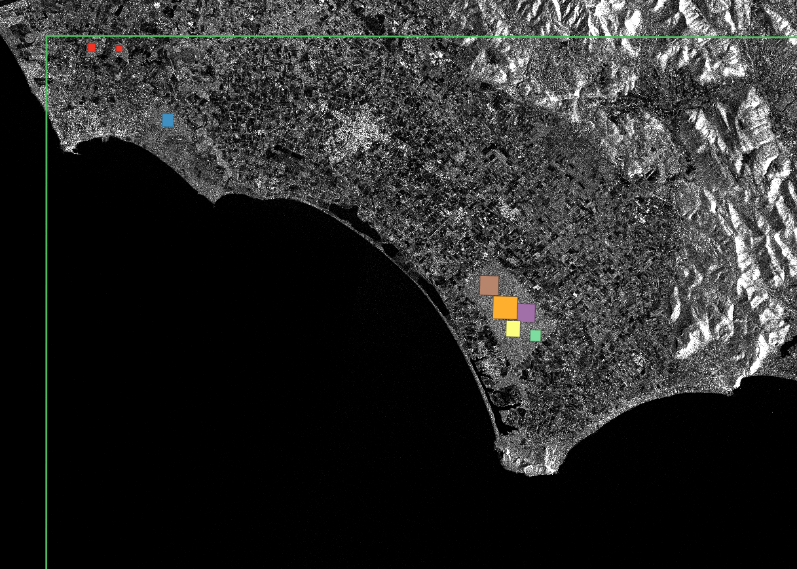

Equivalent Number of Looks (ENL)
================================

The Equivalent Number of Looks (ENL) describes the degree of averaging applied to SAR measurements during data formation
and postprocessing and is an indirect measure of speckle reduction (e.g., due to multilooking or speckle filtering).

In case of linear scaled backscatter data, ENL can be calculated as:

.. math::
    ENL = \frac{\mu^2}{\sigma^2}

where :math:`\mu` is the mean and :math:`\sigma` is the standard deviation of the image. (:cite:`cls_2016`, section A1.1.7)

The ENL value stored in the metadata of each S1-NRB product is calculated as suggested in :cite:`anfinsen.etal_2009`, where ENL is first
calculated for small pixel windows over the cross-polarized backscatter image and afterwards the median value of
the distribution is selected.

Calculate ENL per image
-----------------------
While only the median value is currently stored in the metadata of each S1-NRB product, it is possible to calculate ENL
as described above for entire images using the function :func:`cesard.metadata.extract.calc_enl`. The following code
example shows how to calculate ENL for 25x25 pixel windows and return the result as a numpy array. The visualization of
the resulting array is shown in Figure 1.

.. code-block:: python

    from s1ard.metadata.extract import calc_enl

    tif = "s1a-iw-nrb-20220721t051225-044194-05465e-33tuf-vh-s-lin.tif"
    enl_arr = calc_enl(tif=tif, block_size=25, return_arr=True)

.. figure:: ../_assets/enl_example_tile.png
    :width: 85 %
    :align: center
    :alt: Figure 1: Visualized ENL array for a S1-NRB product.

    Figure 1: Visualized ENL array for a S1-NRB product processed from a Sentinel-1A SLC scene in IW mode for MGRS tile 33TUF
    (coastline between Rome and Naples, Italy).

Comparison between GRDH and NRB
-------------------------------
:cite:`cls_2016` provides estimates of ENL for different Sentinel-1 products (average over all swaths), e.g. ENL of 4.4 for GRDH in
IW mode, and a description of the estimation process in section D1. The following shows a simple comparison between the
GRDH product:

`S1A_IW_GRDH_1SDV_20220721T051222_20220721T051247_044194_05465E_5807`

and a S1-NRB product derived from the equivalent SLC product and processed for MGRS tile 33TUF:

`S1A_IW_SLC__1SDV_20220721T051221_20220721T051249_044194_05465E_BACD`

ENL was calculated for a selection of homogeneous forest areas, which are highlighted in Figure 2. The green outline
traces the north-western corner of MGRS tile 33TUF (see Fig. 1). The resulting scatter plot (Figure 3) shows
consistently higher ENL values for the GRDH product (Avg. ENL: 4.81) in comparison to the S1-NRB product (Avg. ENL: 4.59).

    Figure 2: Selection of homogeneous forest areas for ENL comparison between GRDH and NRB. Green outline: North-western
    corner of MGRS tile 33TUF; Background image: VH backscatter of the GRDH product.

.. figure:: ../_assets/enl_grd_comparison_scatter.png
    :width: 75 %
    :align: center
    :alt: Figure 3: Scatter plot comparing ENL values between GRDH and NRB, calculated for selected areas (see Fig. 2).

    Figure 3: Scatter plot comparing ENL values between GRDH and NRB, calculated for selected areas (see Fig. 2).
